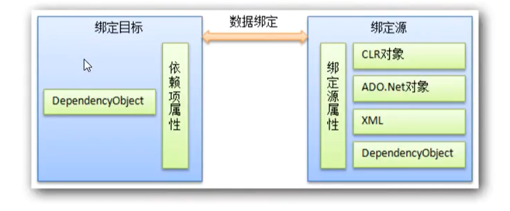

1. 依赖属性

   wpf空间对象定义自定义属性，以便支持扩展，例如：可以自定义按钮的一个依赖属性，实现按钮被over、press等事件时的独特样式

2. 附加属性

   附加属性旨在用作可在任何对象上设置的一类全局属性

3. 路由事件

   其实就是事件在元素上的处理顺序，有隧道（下沉，事件以Preview开头）和冒泡两个过程。

4. xaml语法

   臃肿体系，编译成baml运行，后端使用C#实现逻辑交互

   语法：属性语法、属性元素语法、集合语法

   ```xaml
   <Button>
     <Button.Background>
       <SolidColorBrush Color="Blue"/>
     </Button.Background>
     <Button.Foreground>
       <SolidColorBrush Color="Red"/>
     </Button.Foreground>
     <Button.Content>
       属性元素语法
     </Button.Content>
   </Button>
   ```

   

   ```xaml
   <LinearGradientBrush>
     <LinearGradientBrush.GradientStops>
       <!-- 集合语法？ -->
       <GradientStop Offset="0.0" Color="Red" />
       <GradientStop Offset="1.0" Color="Blue" />
     </LinearGradientBrush.GradientStops>
   </LinearGradientBrush>
   ```

   模板：` <Setter Property="Template">  `，在模板内可以自由编写控件外观的扩展，比如渐变色、圆角等，同时可以通过`TemplateBinding`来绑定控件元素上的属性传值

   触发器：通过属性形式对样式进行设置，某个事件触发，样式自定义显示

   - 标记扩展

# 数据绑定

## 绑定源和绑定目标



## 属性绑定

`{Binding ElementName=xxx,Path=Property}`

绑定模式，也就是数据流的方法：


`Binding.Mode=OneWay/TwoWay/OneWayToSource/OneTime`

## DataContext属性

DataContext属性是在WPF中常用的一个属性，它允许你在XAML中设置一个对象作为数据源，以便在界面上绑定和显示数据。

当你设置一个元素的DataContext属性时，该元素及其子元素都可以通过绑定来访问该数据源对象的属性和方法。这样，你就可以通过数据绑定的方式将数据源对象中的数据显示在界面上，或者通过用户操作更新数据源对象中的数据。

```c#
this.DataContext = this; // 将DataContext绑定到实例对象
```

## 后台数据绑定

```C#
var bing = new Bingding("Text"); // 属性
bing.Source = this.yourSourceName;
targetName.SetBinging(TextBlock.TextProperty, bing);
```

## UpdateSourceTrigger

触发更新源的因素/契机，属性值：`LossFocus/PropertyChanged/Explicit(UpdateSource调用触发)`

```C#
private void Button_Click(object sender, RoutedEventArgs e)
{
    // 获得表达式绑定对象
    var bind = windowTitle.GetBindingExpression(TextBox.TextProperty);
    // 手动触发Explicit
    bind.UpdateSource();
}
```

## 自定义属性/类，源更新而UI界面未更新

实现`INotifyPropertyChanged`

```C#
    User user = new User();
    public DataBinding()
    {
        InitializeComponent();
        user.Name = "qqhuan";
        this.DataContext = user;
    }

    private void Button_Click_1(object sender, RoutedEventArgs e)
    {
        // 此处更新了属性值
        this.user.Name = "change";
    }
}

public class User : INotifyPropertyChanged
{
    private string _name { get; set; }

    public string Name
    {
        get { return _name; }
        set {
          	_name = value; 
            // 此处调用事件通知
            OnPropertyChanged("Name");  
        }
    }

    // 成员事件，必须实现
    public event PropertyChangedEventHandler PropertyChanged; 

    /// <summary>
    /// 源数据发生变化时，向界面推送更新消息
    /// </summary>
    /// <param name="propertyName">更新的属性名</param>
    public void OnPropertyChanged(string propertyName)
    {
        if(PropertyChanged != null)
        {
            PropertyChanged.Invoke(this, new PropertyChangedEventArgs(propertyName));
        }
    }
```

## 列表元素更新无法更新到UI

不使用`List`而是`ObservableCollection`，其中`ObservableCollection`其实是实现了`INotifyPropertyChanged`和`INotifyCollectionChanged`

```C#
public partial class ListBindingWindow : Window
{
    // key point，注意，ObservableCollection只关注元素级别的变动
    private ObservableCollection<Userinfo> _list = new ObservableCollection<Userinfo>();
    public ListBindingWindow()
    {
        InitializeComponent();
        InitUserList();
        userlist.ItemsSource = _list;
    }

    private void InitUserList()
    {
        _list.Add(new Userinfo { Name="Java"});
        _list.Add(new Userinfo { Name="C++"});
        _list.Add(new Userinfo { Name="Go"});
        _list.Add(new Userinfo { Name="Python"});
    }

    private void UpdateBtn_Click(object sender, RoutedEventArgs e)
    {
        if(userlist.SelectedItem != null)
        {
            (userlist.SelectedItem as Userinfo).Name = "Golang";
        }
    }

    private void DeleteBtn_Click(object sender, RoutedEventArgs e)
    {
        if (userlist.SelectedItem != null)
        {
            _list.Remove((userlist.SelectedItem as Userinfo));
        }
    }

    private void AddBtn_Click(object sender, RoutedEventArgs e)
    {
            _list.Add(new Userinfo { Name = "C#" });
    }
}
public class Userinfo : INotifyPropertyChanged
{
    private string _name;
    public string Name
    {
        get { return _name; }
        set { 
            _name = value; 
            OnPropertyChanged(nameof(Name));
        }
    }

    public event PropertyChangedEventHandler PropertyChanged;

    public void OnPropertyChanged(string propertyName)
    {
        if(PropertyChanged != null)
        {
            PropertyChanged.Invoke(this, new PropertyChangedEventArgs(propertyName));
        }
    }
}
```

## 类型转换器Converter

静态资源中引入，在使用的标签元素属性中使用Binding来绑定

```xaml
<Window.Resources>
    <local:BooleanConverter x:Key="booleanConverter"/>
</Window.Resources>
<StackPanel>
    <TextBox Name="input" Width="200"/>
    <WrapPanel>
        <TextBlock Text="输入的值为："/>
        <TextBox Text="{Binding ElementName=input,Path=Text,Converter={StaticResource booleanConverter}}" Width="200"/>
    </WrapPanel>
    <WrapPanel>
        <CheckBox Content="选我" IsChecked="{Binding ElementName=input,Path=Text,Converter={StaticResource booleanConverter}}"/>
    </WrapPanel>
</StackPanel>
```

```c#
public class BooleanConverter : IValueConverter
{
    public object Convert(object value, Type targetType, object parameter, CultureInfo culture)
    {
        var val = value.ToString().ToLower();
        switch (val)
        {
            case "true":
                return true;
            case "yes":
                return true;
            case "false":
                return false;
        }
        return false;
    }

    public object ConvertBack(object value, Type targetType, object parameter, CultureInfo culture)
    {
        throw new NotImplementedException();
    }
}
```

