## 控件

### 文本类控件

1. Label

2. Button

   窗体设置`AcceptButton=按钮`、`CancelButton=按钮`（其实就是使之获得焦点），按下`enter`、`esc`相当于单击按钮

3. TextBox

   `Multiline`属性值设置为`true`，可以设置`Height`

   `SelectionStart`、`SelectionLength`可以用来控制选中的文字

4. RichTextBox

   相当于html的textarea

### 选择类控件

   - ComboBox

     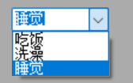

   - CheckBox

     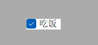

   - RadioButton

     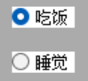

   - NumbericUpDown

     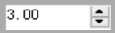

   - ListBox

     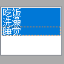

### 分组类控件

- Panel，普通容器

  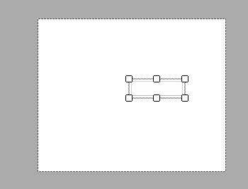

- GroupBox，带标题的容器

  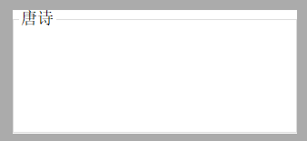

- TabControl，选项卡

  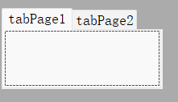

### 菜单、工具栏和状态栏

- MenuStrip

  快捷键，`文件(&F)`，即`Alt+F`

  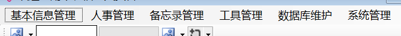

- ToolStrip

  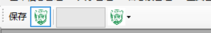

- StatusStrip

  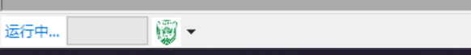

